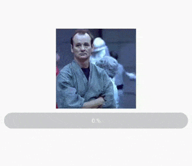

# React-Native-Interactive-Touchable

## API

\<InteractiveTouchable\/> bases on \<Pressable \/> API provided from React-Native and inherits all Pressable Props.

Requires [Reanimated 2](https://github.com/software-mansion/react-native-reanimated) and [React Native >= 0.63](https://github.com/facebook/react-native).

> React Native Reanimated v2 needs extra steps to finalize its installation, please follow their installation [instructions .](https://docs.swmansion.com/react-native-reanimated/docs/fundamentals/installation).

### Install
```
npm i react-native-interactive-touchable
```

```
yarn add react-native-interactive-touchable
```

### Import 
```
 import InteractiveTouchable from 'react-native-interactive-touchable';
```

### Usage





> Sample Usage Example

```
import React from 'react';

import { View, StyleSheet, Image } from 'react-native';

import InteractiveTouchable from 'react-native-interactive-touchable';

const TouchableScale = () => {
  return (
    <InteractiveTouchable activeScale={0.8} activeOpacity={0.4}>
      <Image
        style={styles.image}
        source={{ uri: 'https://www.fillmurray.com/640/360' }}
      />
    </InteractiveTouchable>
  );
};

const styles = StyleSheet.create({
  image: { width: 200, aspectRatio: 1, alignSelf: 'center'},
});

```

> Advanced Usage Example

```
import React from 'react';

import { View, StyleSheet, Image } from 'react-native';

import InteractiveTouchable from 'react-native-interactive-touchable';

import Animated, {
  interpolate,
  useSharedValue,
  useAnimatedStyle,
} from 'react-native-reanimated';

const TouchableRotate = () => {
  const animatedProgress = useSharedValue(0);

  const animatedStyles = useAnimatedStyle(() => ({
    transform: [
      {
        rotate: `${interpolate(animatedProgress.value, [0, 1], [0, 720])}deg`,
      },
    ],
  }));

  return (
    <View>
      <InteractiveTouchable
        activeOpacity={0.9}
        activeScale={0.7}
        animationConfigs={{
          duration: 1000,
        }}
        animatedProgress={animatedProgress}
      >
        <Animated.View style={animatedStyles}>
          <Image
            style={styles.image}
            source={{ uri: 'https://www.fillmurray.com/600/600' }}
          />
        </Animated.View>
      </InteractiveTouchable>

      <ProgressBar progress={animatedProgress} />
    </View>
  );
}

```

### Props for Customization 

| Prop                    | Type                  | Default      | Description                                        |
| :---------------------: | :----------:          | :----------: | :------------------------------------------------: |
| defaultScale            | Number                | 1            | Determines what the scale of the wrapped view should be when touch is not active                                                |
| activeScale             | Number                | 0.95         | Determines what the scale of the wrapped view should be when touch is active                                                                                                   |
| activeOpacity           | Number                | 1            | Determines what the opacity of the wrapped view should be when touch is not active                                                
| animatedProgress        | Animated.SharedValue  | undefined    | Animated value to be used as a callback for the index node internally.                   |
| animationConfigs        | Animated.WithSpringConfig \| \| Animated.WithTimingConfig                | undefined    | Object carrying pressIn and pressOut animation configuration. |
| pressInAnimationConfigs | Animated.WithSpringConfig \| \| Animated.WithTimingConfig                | undefined    | Object carrying pressIn animation configuration.             |
| pressOutAnimationConfigs| Animated.WithSpringConfig \| \| Animated.WithTimingConfig                | undefined    | Object carrying pressOut animation configuration.              |
| onPressInAnimationEnd   | (isFinished: Boolean) => void;              | undefined  | The provided function will be called when the animation is complete. In case the animation is cancelled, the callback will receive false as the argument, otherwise it will receive true. |
| onPressOutAnimationEnd  | (isFinished: Boolean) => void;                | undefined          | The provided function will be called when the animation is complete. In case the animation is cancelled, the callback will receive false as the argument, otherwise it will receive true.                             |

## Objects passed to animationConfigs | pressInAnimationConfigs | pressOutAnimationConfigs

### Animated.WithSpringConfig
| Options                   | Default  |  
| :-----------------------: | :------: |
| damping                   | 10       |
| mass                      | 1        | 
| stiffness                 | 100      | 
| overshootClamping         | false    | 
| restDisplacementThreshold | 0.01     | 
| restSpeedThreshold        | 2        | 

### Animated.WithTimingConfig
| Options   | Default              |  
| :-------: | :------------------: |
| duration  | 300                  |
| easing    | in-out quad easing   | 


## License

MIT